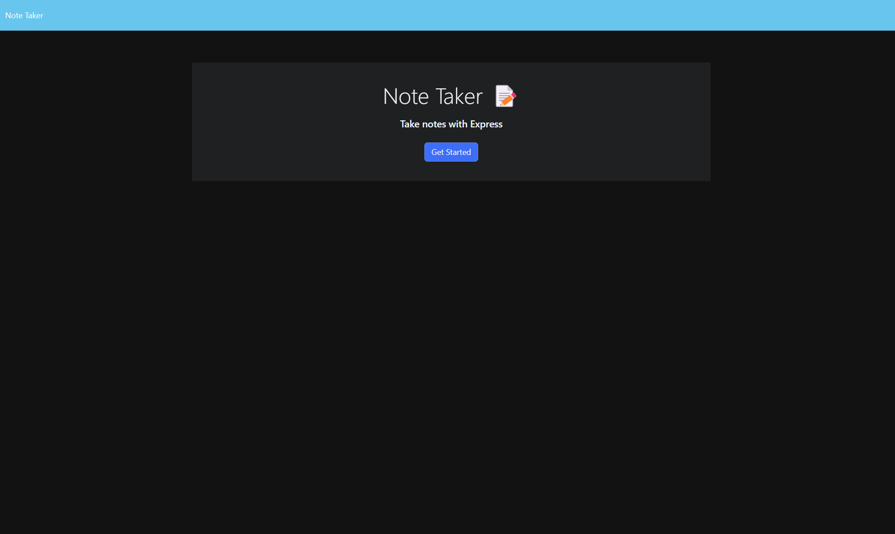

# Note Taker

## Description

  - The motivation for this project was to create a full stack application that allows users to store notes for future use.
  - This project was built to get a grasp on how to manage servers and routes through Express.js
  - This project gives users a way to store important notes to themselves. These notes could be To-Dos, reminders, study notes, etc.
  - This project helped me grasp the process of creating routes, storing data in a server, accessing data already stored, adding new data to the existing, and how Insomnia can assist developers when creating full stack applications
  - In the future I plan to add the functionality of the delete method to allow users to delete existing notes.
  
  To visit the Note Taker application click [here!](https://lit-eyrie-49322-e0487ec15df8.herokuapp.com/)

## Table of Contents

  - [Installation](#installation)
  - [Usage](#usage)
  - [Mock-Up](#mock-up)
  - [License](#license)
  - [Contributing](#contributing)
  - [Tests](#tests)
  - [Questions](#questions)

## Installation
  
  N/A
  
## Usage
  
  To use this application the user must click the 'Get Started' button on the home page. They will be routed to the notes page where they can view existing notes by clicking on them or add new notes by clicking in the text area that says 'Note Title' and type in the title of their new note, then click in the text area that says 'Note Text' to type in the body of the note they'd like to save. To save the note, the user needs to click on the save icon in the top right corner of the application and they will see it added to the list of existing notes on the left side. If the title and body text areas have notes in them already, the user can click on the plus icon in the top right corner next to the save icon to begin a new note.
  
## Mock-Up

  The following images show the application's design and functionality.

  

  

## License

  N/A

## Contributing

  All contributions should be made by cloning this repository and creating a new working branch. All changes should be submitted via pull request on GitHub for review.
  
## Tests

  N/A

## Questions

  GitHub: [PRich57](https://github.com/PRich57)

  Email: pcrichards57@gmail.com

  Please direct all additional questions regarding this application to my email address provided above.

  